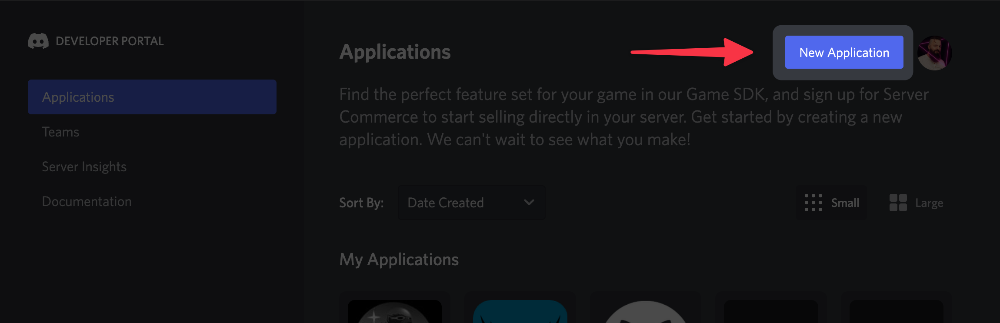
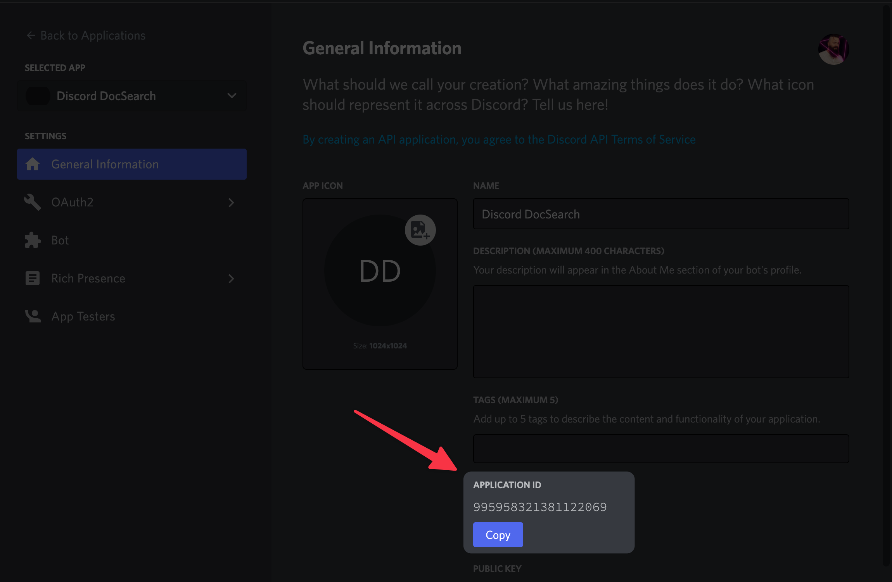
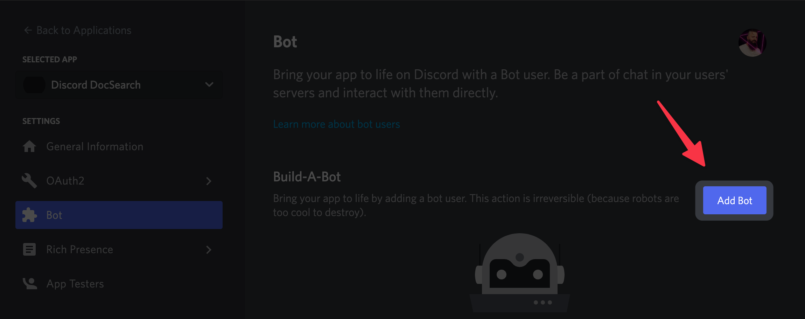
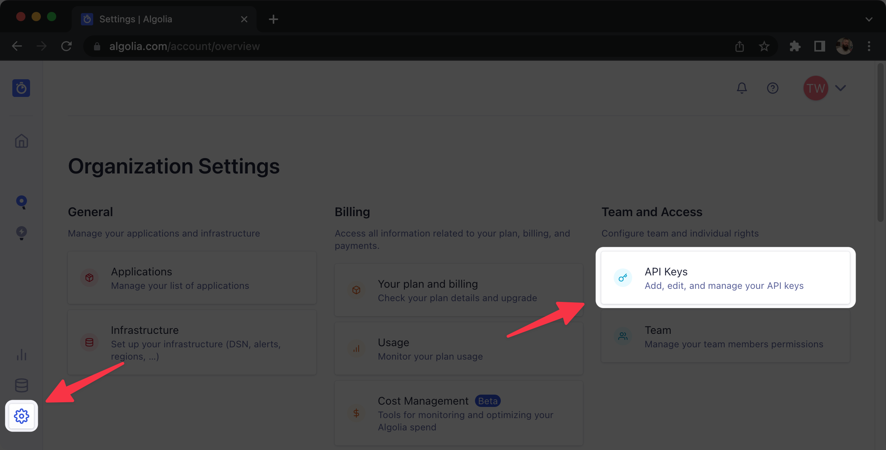
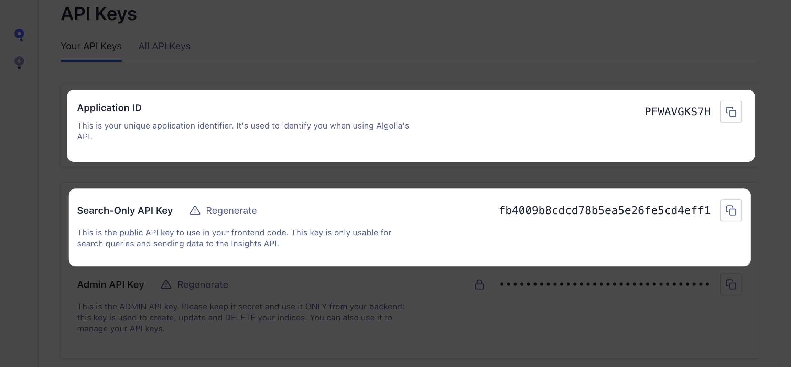
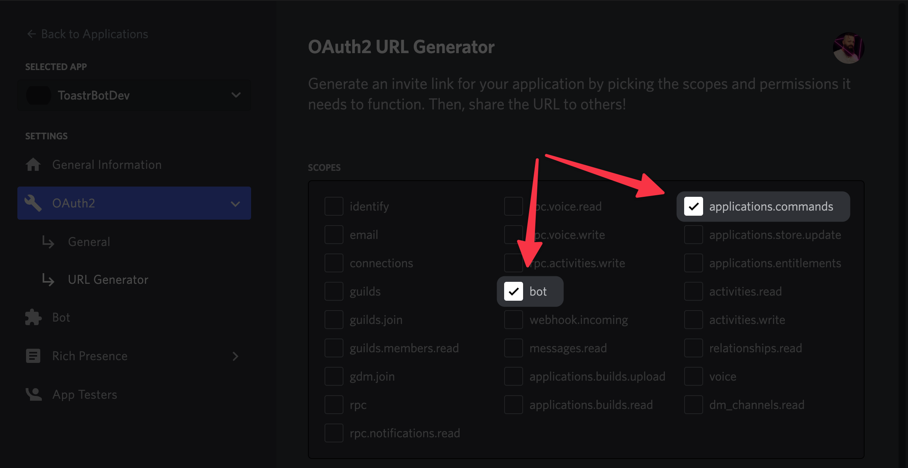
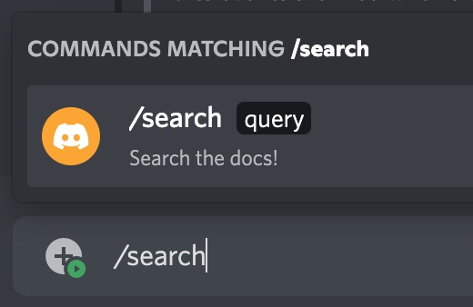
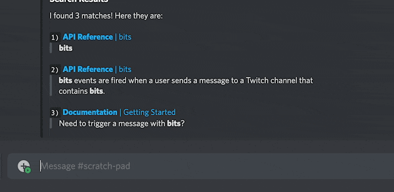
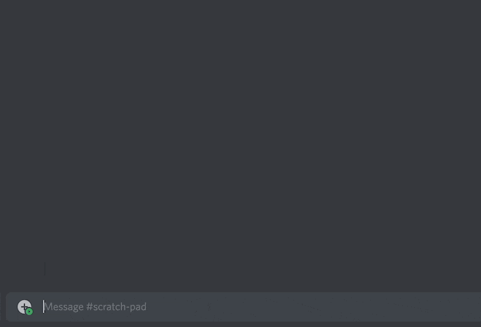
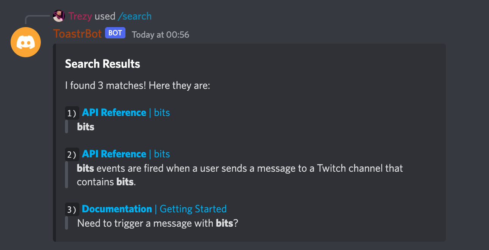

As an open source maintainer, I _love_ [Algolia's DocSearch](https://docsearch.algolia.com/). I send in an application, they set me up, and I have excellent search on my docs site _for free_. 💸

I also love Discord! It's been an extremely valuable tool in gathering the communities around my open source projects so users can share projects, use cases, and war stories. However, I recently had a thought. It was one of those ideas that seems so obvious, but nobody ever notices it. As soon as it comes to you, it's like a missile screaming right into your noggin.

The idea? **Using DocSearch _in Discord_**.

I know, I know, I'm brilliant... but hold the applause until later. After all, DocSearch is the real hero here — but feel free to still clap for me, too. 😉

When this whole thing crossed my mind, I decided to do some digging. As it turns out, DocSearch is backed by [Algolia's Search](https://www.algolia.com/products/search-and-discovery/hosted-search-api/) product, which means everything is also available via their API. With my brain exploding and my eyes glowing, I set out to make a Discord bot that allows an Algolia DocSearch enabled site to be searched _directly inside Discord_.

# The Starting Point

There are a couple things we need to do before we can start writing code. We need to…

- Create a Discord bot application.
- Create an Algolia application.

## Creating a Discord Bot

<Notice>Creating Discord bots has changed *a lot* over the years, so if you've built one before but it's been a while then this section should be a good refresher.</Notice>

The first step is to head over to [discord.com/developers](https://discord.com/developers) and click the "New Application" button.

<figure>
  
</figure>

Once you've created your application, you'll see the "General Information" screen. Below your app's basic info, you'll see your Application ID. Save this somewhere; we're going to need it when we start writing code.

<figure>

<figcaption>You Discord app's ID will be just below the app's name, description, and tags fields.</figcaption>
</figure>

Next, we'll need to add a bot to our app! Click on "Bot" in the left panel, then click "Add Bot." You'll need to confirm that you really want to do this (you do), and finally Discord will create a Bot account for your app.

<figure>

</figure>

The last step is to get an API token for your new bot. You can do this by clicking the "Reset Token" button just below your bot's username. Copy the token and save it in the same place you stored your app ID.

## Creating an Algolia App

<Notice>
  If you already have DocSearch set up for your project, you can skip this step! You'll just need to grab the app ID and API key as mentioned in the last paragraph. **However**, I'll point out that this bot could actually be used to search *any Algolia index*. Your product search, employee directory, Pokémon collection… the world is your [Cloyster](https://pokemondb.net/pokedex/cloyster).

  
</Notice>

Creating an Algolia app is significantly less convoluted than creating a Discord app. 😅 You've got 2 options:

1. Login to your account, then go to `Settings > Applications` and click "New application"; OR
2. Go straight to the app creation screen at [algolia.com/account/plan/create](https://www.algolia.com/account/plan/create)

You'll need to select a plan and region, accept Algolia's Terms of Service, and your app is created!

That's not quite the end of the process, of course… we still need something to search! I could get into the process of getting your data together and creating your first index, but I'll let Algolia handle that part. They've got an amazing interactive tutorial for creating your first index… [check it out here](https://www.algolia.com/doc/onboarding).

The last step within Algolia will be retrieving our app ID and API token. You can get both by going to `Settings > API Keys`.

<figure>
  
  
</figure>

From this page you'll want to grab the app ID and — this part is really important — the Search-Only API key. This API key prevents the app from doing things like creating indexes and changing data. If you want to update your bot to allow those behaviours, you can come back and grab the Admin API key later.

# Let's Write Some Code!

Our apps have been created and *we are ready*. Let's get into the meat of this thing.

## Setup the Project Directory

We'll get the basics out of the way first. Create a new directory for our bot and use either npm or Yarn to create a new Node.js project.

```bash
## Create and open the project directory
mkdir discord-docsearch && cd discord-docsearch

# Initialise your Node project
npm init -y
# OR
yarn init -y
```

### Install Required Packages

There are a handful of packages we'll need to make this work. Let's run through what they're for.

#### `discord.js`

There are a few packages we'll be installing for `discord.js`:

* `@discordjs/rest`
  A client for using the Discord REST API - most of what we do will be using Discord's real-time Gateway APIs, but this will be necessary for registering our commands.
* `discord-api-types`
  Used for generating Discord REST API routes, but it provides classes for lots of different Discord things.
* `discord.js`
  The main lib! Simplifies the process of connecting to and using Discord's APIs.

#### `algoliasearch`

This is Algolia's official JavaScript SDK! It abstracts away a lot of the work of connecting to and searching with Algolia's APIs.

#### `dotenv`

This one isn't strictly necessary, but it will make our lives a lot easier. It allows us to specify our environment variables in a `.env` file, then it injects those variables into `process.env`. Super convenient!

---

Let's get everything installed.

```bash
npm install discord.js @discordjs/rest discord-api-types algoliasearch dotenv
# OR
yarn add discord.js @discordjs/rest discord-api-types algoliasearch dotenv
```

### Setup the Config

The first file we'll want to create is `.env` right in the root of our project.

```bash
touch .env
```

Once you've created the file, open it up in your IDE and paste the following, replacing the bracketed text with the strings we got from your Discord and Algolia apps in the first 2 steps:

```bash
ALGOLIA_APPLICATION_ID=[your-algolia-id-goes-here]
ALGOLIA_API_KEY=[your-key-goes-here]
DISCORD_API_TOKEN=[your-token-goes-here]
DISCORD_CLIENT_ID=[your-discord-id-goes-here]
```

We're also going to build this bot using ES modules, so we'll need to tell Node that it should treat the whole app like a module. We just need to update the `type` in our `package.json` file:

```json
{
	"name": "...",
	"type": "module",
	"dependencies": {}
}
```

## Creating Our Bot

Now we can create a new file called `index.js` at the root of our project and start writing some JavaScript!

Let's start by creating a Discord client and connecting to the Discord Gateway APIs. Note that you'll see "Guilds" mentioned a lot in our code; that's the official name for Discord servers.

```jsx
import {
	Client,
	GatewayIntentBits,
} from 'discord.js'

// Destructure our Discord API token from the global environment variables. We'll be doing this a lot.
const { DISCORD_API_TOKEN } = process.env

const DISCORD_CLIENT = new Client({
	// We need to define intents so Discord knows what data to send our bot. Here we're only using the Guilds intent, so Discord will let us know about changes to the servers we're in.
	intents: [GatewayIntentBits.Guilds],
})

async function handleReady() {
	console.log('Ready!')
}

// The ready event is triggered once the client has successfully logged in.
DISCORD_CLIENT.once('ready', handleReady)

// Connect the bot to Discord!
DISCORD_CLIENT.login(DISCORD_API_TOKEN)
```

If you try running your code now using `node ./index.js`, you'll see the following error:

```jsx
Error [TOKEN_INVALID]: An invalid token was provided.
```

That's because we haven't told `dotenv` to load our `.env` file yet! Fortunately it's a quick fix. Just add `import 'dotenv/config'` to the top of your file and try running it agin. You should see `Ready!` printed in the console! 🥳

This is a great start, but our bot doesn't have anything to respond to. Let's create a function to register a `/search` command with Discord.

## Creating Commands

It's important to know that Discord bots can register 2 types of commands: guild and global. Global commands are available immediately to every server the Discord bot is in, whereas guild commands must be registered each time the bot joins a server. Based on just this information, it's easy to assume that you'd always want to create global commands, but there's a catch. Global commands can take a *long* time to update, but guild commands update instantly. It's almost always better to register guild commands when in development.

We'll start by creating a function to encapsulate the work of creating new commands.

```jsx
import { Routes } from 'discord-api-types/v9'

const { DISCORD_CLIENT_ID } = process.env

async function registerCommands(guildID) {
	// Generate the API route for updating bot commands within this server.
	const route = Routes.applicationGuildCommands(DISCORD_CLIENT_ID, guildID)
}
```

Next we'll use `discord.js`'s convenient `SlashCommandBuilder` class to construct our `/search` command.

```jsx
import { Routes } from 'discord-api-types/v9'
import { SlashCommandBuilder } from 'discord.js'

const { DISCORD_CLIENT_ID } = process.env

async function registerCommands(guildID) {
	// Generate the API route for updating bot commands within this server.
	const route = Routes.applicationGuildCommands(DISCORD_CLIENT_ID, guildID)

	// Create an object representing our /search command for the Discord API.
	const commandData = new SlashCommandBuilder()
		.setName('search')
		.setDescription('Search the docs!')
		.addStringOption(option => {
			return option
				.setName('query')
				.setDescription('The query to be searched')
				.setRequired(true)
		})
		.toJSON()
}
```

Whoa, okay… all of a sudden there's **a lot** going on. Let's dig in a little deeper.

`discord.js`'s [`SlashCommandBuilder`](https://discord.js.org/#/docs/builders/1.0.0/class/SlashCommandBuilder) has a bunch of methods for setting up how a command should work in Discord. For our purposes, we're doing the following:

- Setting the name that will be used to invoke the command in Discord (`search`)
- Setting a description to be shown when Discord opens it's command auto-complete box
- Adding a string option (similar to flags in CLI apps)
    - Setting the option's name to `query`
    - Setting a description (handled similar to the command's description)
    - Setting the option as required (Discord won't send the command to your app if required fields are missing)
    - Options can be a handful of different types, making it easy for Discord to help users with autocompletions
- Converting the whole thing to JSON

If you want to make more complex commands, you can check out the [`SlashCommandBuilder`](https://discord.js.org/#/docs/builders/1.0.0/class/SlashCommandBuilder) docs.

Now that we have a command, we need to add it to Discord when we start the app! We'll need to create a new Discord REST API client, then use it to send the slash command data.

```jsx
import { REST } from '@discordjs/rest'
import { Routes } from 'discord-api-types/v9'
import { SlashCommandBuilder } from 'discord.js'

const {
	DISCORD_API_TOKEN,
	DISCORD_CLIENT_ID,
} = process.env

// Create a client for accessing the Discord REST API
const DISCORD_REST_CLIENT = new REST({ version: '10' })
	.setToken(DISCORD_API_TOKEN)

async function registerCommands(guildID) {
	// Generate the API route for updating bot commands within this server.
	const route = Routes.applicationGuildCommands(DISCORD_CLIENT_ID, guildID)

	// Create an object representing our /search command for the Discord API.
	const commandData = new SlashCommandBuilder()
		.setName('search')
		.setDescription('Search the docs!')
		.addStringOption(option => {
			return option
				.setName('query')
				.setDescription('The query to be searched')
				.setRequired(true)
		})
		.toJSON()

	// Send the command object to Discord
	await DISCORD_REST_CLIENT.put(route, { body: [commandData] })

	console.log('Successfully created the /search command!')
}
```

---

Okay, our `registerCommands` function is ready to start adding commands to Discord, so let's put it to use! Update your `handleReady` function with the following code.

```jsx
async function handleReady() {
	// Get the collection of servers the bot is already in
	const guilds = await DISCORD_CLIENT.guilds.fetch()

	// Convert the guilds collection to an array of guild IDs
	const guildIDs = Array.from(guilds.keys())

	// Loop over guild IDs and register commands for each server
	let guildIndex = 0
	while (guildIndex < guildIDs.length) {
		const guildID = guildIDs[guildIndex]

		await registerCommands(guildID)
		guildIndex += 1
	}
}
```

The `while` loop allows us to perform our API calls sequentially, which is helpful for avoiding hitting rate limits.

We'll also want to add this functionality to the `guildCreate` event, which is triggered when the bot joins a guild. Create a new `handleGuildCreate` function…

```jsx
async function handleGuildCreate(guild) {
	await registerCommands(guild.id)
}
```

…and add this just after your `ready` handler:

```jsx
DISCORD_CLIENT.on('guildCreate', handleGuildCreate)
```

If you've been following along, our entire `index.js`file should look like this:

```jsx
import 'dotenv/config'

import {
	Client,
	GatewayIntentBits,
	SlashCommandBuilder,
} from 'discord.js'
import { REST } from '@discordjs/rest'
import { Routes } from 'discord-api-types/v9'

const {
	DISCORD_API_TOKEN,
	DISCORD_CLIENT_ID,
} = process.env
const DISCORD_CLIENT = new Client({ intents: [GatewayIntentBits.Guilds] })
const DISCORD_REST_CLIENT = new REST({ version: '10' })
	.setToken(DISCORD_API_TOKEN)

async function handleGuildCreate(guild) {
	await registerCommands(guild.id)
}

async function handleReady() {
	const guilds = await DISCORD_CLIENT.guilds.fetch()
	const guildIDs = Array.from(guilds.keys())

	let guildIndex = 0
	while (guildIndex < guildIDs.length) {
		const guildID = guildIDs[guildIndex]

		await registerCommands(guildID)
		guildIndex += 1
	}

	console.log('Ready!')
}

async function registerCommands(guildID) {
	const route = Routes.applicationGuildCommands(DISCORD_CLIENT_ID, guildID)
	const commandData = new SlashCommandBuilder()
		.setName('search')
		.setDescription('Search the docs!')
		.addStringOption(option => {
			return option
				.setName('query')
				.setDescription('The query to be searched')
				.setRequired(true)
		})
		.toJSON()

	await DISCORD_REST_CLIENT.put(route, { body: [commandData] })

	console.log('Successfully created the /search command!')
}

DISCORD_CLIENT.once('ready', handleReady)
DISCORD_CLIENT.on('guildCreate', handleGuildCreate)
DISCORD_CLIENT.login(DISCORD_API_TOKEN)
```

Let's test our app in Discord! Head back to your Discord app dashboard, then click OAuth2 > URL Generator in the left panel. On the URL generator page, you'll need to select the `bot` and `applications.commands` scopes. You'll also want to check the `Send Messages` permission (it'll show up after you select the `bot` scope). Now you can copy the URL at the bottom of the page!

<figure>
  
</figure>

Pop that URL into your browser and you'll be prompted to choose a server to add the bot to. You'll need to have appropriate permissions on the server, otherwise it won't show up in the list.

Once you've selected a server and confirmed everything, start up your app and head over to your server! You should now be able to type `/search` and see some autocomplete options for our new command.

<figure>
  
</figure>

## Let's Search 🔎

Now that our bot is hooked up to Discord, it's time to handle searches. The first step is to add a new handler and function for the `interactionCreate` event.

```jsx
DISCORD_CLIENT.on('interactionCreate', handleInteractionCreate)

async function handleInteractionCreate() {}
```

This event will be triggered for any type of interaction, as well as for every command. Just to be safe, we'll want to exit early if the interaction isn't a command, or if it's the wrong command.

```jsx
import { InteractionType } from 'discord.js'

async function handleInteractionCreate(interaction) {
	// Exit if it's a non-command interaction.
	if ((interaction.type !== InteractionType.ApplicationCommand)) {
		return
	}

	// Exit if it's a command other than /search.
	if (interaction.commandName !== 'search') {
		return
	}
}
```

And for safety's sake, we’ll wrap the rest of our code in a try/catch block in case we run into any issues.

```jsx
import { InteractionType } from 'discord.js'

async function handleInteractionCreate(interaction) {
	// Exit if it's a non-command interaction.
	if ((interaction.type !== InteractionType.ApplicationCommand)) {
		return
	}

	// Exit if it's a command other than /search.
	if (interaction.commandName !== 'search') {
		return
	}

	try {
	} catch (error) {
		// Log any errors we run into
		console.error(error)
	}
}
```

To actually respond to the command, we’ll want to first call [`interaction.deferReply()`](https://discord.js.org/#/docs/discord.js/main/class/CommandInteraction?scrollTo=deferReply). This tells Discord that we intend to reply, but we’ll need some time. It’s good practice to start with `deferReply()` if your command has to perform async actions. If you’re not doing anything asynchronous, you just use [`interaction.reply()`](https://discord.js.org/#/docs/discord.js/main/class/CommandInteraction?scrollTo=reply).

```jsx
async function handleInteractionCreate(interaction) {
	'...'

	try {
		await interaction.deferReply()
	} catch (error) {
		console.error(error)
	}
}
```

Next, we’ll retrieve the value of the `query` option from the interaction.

```jsx
async function handleInteractionCreate(interaction) {
	'...'

	try {
		await interaction.deferReply()

		const query = interaction.options.get('query').value
	} catch (error) {
		console.error(error)
	}
}
```

And now — just for testing — we’ll echo the query back to the user.

```jsx
async function handleInteractionCreate(interaction) {
	'...'

	try {
		await interaction.deferReply()

		const query = interaction.options.get('query').value

		await interaction.editReply(`You queried for \`${query}\``)
	} catch (error) {
		console.error(error)
	}
}
```

If we try to send our command again, we should see a response that echoes our query back at us!

<figure>
  
</figure>

Now for the magic… let’s get our bot to actually query the docs! First, we need to create the Algolia client and initialise the index.

```jsx
// Grab the default import from the Algolia SDK
import algolia from 'algoliasearch'

// Destructure our Algolia app ID and API key from the global environment variables
const {
	ALGOLIA_API_KEY,
	ALGOLIA_APPLICATION_ID,
} = process.env

// Create a new Algolia client that we can use for initialising indexes and performing searches
const ALGOLIA_CLIENT = algolia(ALGOLIA_APPLICATION_ID, ALGOLIA_API_KEY)

// Initialise the index
const DOCS_INDEX = ALGOLIA_CLIENT.initIndex('docs')
```

We can then use our query to search against the index.

```jsx
async function handleInteractionCreate(interaction) {
	'...'

	try {
		await interaction.deferReply()

		const query = interaction.options.get('query').value

		const response = await DOCS_INDEX.search(query, { hitsPerPage: 3 })

		// Exit early if there aren't any matches
 		if (response.hits.length === 0) {
			await interaction.editReply('No results found')
			return
		}

		// Compile the matches into a Markdown formatted string
		let reply = `Found ${response.nbHits} matches; here are the top 3:`
		response.hits.forEach(hit => {
			reply += `\n- ${hit.url}`
		})

		await interaction.editReply(reply)
	} catch (error) {
		console.error(error)
	}
}
```

The [`index.search()`](https://www.algolia.com/doc/api-reference/api-methods/search/) method allows us to run a search against our index for any arbitrary query. It’ll return the results as an array, including info on which parts of the matched string to highlight. We’ll use all of that info in a bit to make the response more robust, but for now we’re just going to print all of the matched URLs.

<figure>

<figcaption>This is what the results look like when making a query against the DocSearch index for [fdgt.dev](https://fdgt.dev)</figcaption>
</figure>

Looking good! All that’s left is to pretty up these results! I started by taking a look at the designs on other DocSearch enabled websites. After trying out several different options, I landed on something pretty nice, if a bit verbose in the code. Here’s what the results look like:

<figure>

</figure>

I’m using a Discord Embed (via `discord.js`'s [`EmbedBuilder`](https://discord.js.org/#/docs/builders/1.0.0/class/EmbedBuilder) class). This allows us to use more robust Markdown formatting (like inline links). The rest is string manipulation and Markdown.

As I mentioned, the code is a bit tedious, but it works quite well. However, you’ll likely need to update it if you’re not using the typical DocSearch structure.

```jsx
import { EmbedBuilder } from 'discord.js'

async function handleInteractionCreate(interaction) {
	'...'

	try {
		await interaction.deferReply()

		const query = interaction.options.get('query').value

		const response = await DOCS_INDEX.search(query, { hitsPerPage: 3 })

		// Exit early if there aren't any matches
 		if (response.hits.length === 0) {
			await interaction.editReply('No results found')
			return
		}

		let headingString = `I found ${response.nbHits} matches!`

		if (response.nbHits <= 3) {
			headingString += ' Here they are:'
		} else {
			headingString += ' Here are the top 3:'
		}

		// Loop over the results to generate strings with Markdown formatting.
		const resultsString = response.hits
			.reduce((accumulator, hit, index) => {
				// We'll store each line of the result string in this array, then we'll compile it at the end.
				const stringPieces = []

				// Bold the main category.
				const categoryTitle = `**${hit.hierarchy.lvl0}**`
				const pageTitle = hit.hierarchy.lvl1

				// Format the result number as inline code to keep everything aligned.
				const resultNumber = `\`${index + 1})\``

				// Wrap the result title in a link.
				stringPieces.push(`${resultNumber} [${categoryTitle} | ${pageTitle}](${hit.url})`)

				// Get the lowest level match (defaults to page title) to be displayed as the result body.
				let matchValue = hit._highlightResult.hierarchy.lvl1.value

				if (hit.hierarchy.lvl2) {
					matchValue = hit._highlightResult.hierarchy.lvl2.value
				}

				// Algolia injects some HTML into the string to make it easier to highlight the parts of the string that actually matched. We'll replace those with Markdown formatting instead.
				matchValue = matchValue.replace(/<span class="algolia-docsearch-suggestion--highlight">(.*?)<\/span>/g, '**$1**')

				// Wrap the result body in a block quote.
				stringPieces.push(`> ${matchValue}`)

				accumulator.push(stringPieces.join('\n'))
				return accumulator
			}, [])
			.join('\n\n')

		// Updates the "thinking" response to show our search results!
		await interaction.editReply({
			embeds: [
				new EmbedBuilder()
					.setTitle('Search Results')
					.setDescription(`${headingString}\n\n${resultsString}`),
			],
		})
	} catch (error) {
		console.error(error)
	}
}
```

### The Final Script

After all of this work, here it is... the complete code for our bot in all of it's glory. 🤩

<details>
	<summary>Full Script</summary>
	```js
	import 'dotenv/config'

	import {
		Client,
		EmbedBuilder,
		GatewayIntentBits,
		InteractionType,
		SlashCommandBuilder,
	} from 'discord.js'
	import algolia from 'algoliasearch'
	import { REST } from '@discordjs/rest'
	import { Routes } from 'discord-api-types/v9'

	const {
		ALGOLIA_API_KEY,
		ALGOLIA_APPLICATION_ID,
		DISCORD_API_TOKEN,
		DISCORD_CLIENT_ID,
	} = process.env

	const ALGOLIA_CLIENT = algolia(ALGOLIA_APPLICATION_ID, ALGOLIA_API_KEY)
	const DISCORD_CLIENT = new Client({ intents: [GatewayIntentBits.Guilds] })
	const DISCORD_REST_CLIENT = new REST({ version: '10' }).setToken(DISCORD_API_TOKEN)
	const DOCS_INDEX = ALGOLIA_CLIENT.initIndex('docs')

	async function handleGuildCreate(guild) {
		await registerCommands(guild.id)
	}

	async function handleInteractionCreate(interaction) {
		if ((interaction.type !== InteractionType.ApplicationCommand) || (interaction.commandName !== 'search')) {
			return
		}

		try {
			await interaction.deferReply()

			const query = interaction.options.get('query').value
			const response = await DOCS_INDEX.search(query, { hitsPerPage: 3 })

			if (response.hits.length === 0) {
				await interaction.editReply('No results found')
				return
			}

			let headingString = `I found ${response.nbHits} matches!`

			if (response.nbHits <= 3) {
				headingString += ' Here they are:'
			} else {
				headingString += ' Here are the top 3:'
			}

			const resultsString = response.hits
				.reduce((accumulator, hit, index) => {
					const stringPieces = []
					const categoryTitle = `**${hit.hierarchy.lvl0}**`
					const pageTitle = hit.hierarchy.lvl1
					const resultNumber = `\`${index + 1})\``

					stringPieces.push(`${resultNumber} [${categoryTitle} | ${pageTitle}](${hit.url})`)

					let matchValue = hit._highlightResult.hierarchy.lvl1.value

					if (hit.hierarchy.lvl2) {
						matchValue = hit._highlightResult.hierarchy.lvl2.value
					}

					matchValue = matchValue.replace(/<span class="algolia-docsearch-suggestion--highlight">(.*?)<\/span>/g, '**$1**')

					stringPieces.push(`> ${matchValue}`)

					accumulator.push(stringPieces.join('\n'))
					return accumulator
				}, [])
				.join('\n\n')

			await interaction.editReply({
				embeds: [
					new EmbedBuilder()
						.setTitle('Search Results')
						.setDescription(`${headingString}\n\n${resultsString}`),
				],
			})
		} catch (error) {
			console.error(error)
		}
	}

	async function handleReady() {
		const guilds = await DISCORD_CLIENT.guilds.fetch()
		const guildIDs = Array.from(guilds.keys())

		let guildIndex = 0
		while (guildIndex < guildIDs.length) {
			const guildID = guildIDs[guildIndex]

			await registerCommands(guildID)
			guildIndex += 1
		}

		console.log('Ready!')
	}

	async function registerCommands(guildID) {
		const route = Routes.applicationGuildCommands(DISCORD_CLIENT_ID, guildID)
		const commandData = new SlashCommandBuilder()
			.setName('search')
			.setDescription('Search the docs!')
			.addStringOption(option => {
				return option
					.setName('query')
					.setDescription('The query to be searched')
					.setRequired(true)
			})
			.toJSON()

		await DISCORD_REST_CLIENT.put(route, { body: [commandData] })

		console.log('Successfully created the /search command!')
	}

	DISCORD_CLIENT.once('ready', handleReady)
	DISCORD_CLIENT.on('guildCreate', handleGuildCreate)
	DISCORD_CLIENT.on('interactionCreate', handleInteractionCreate)
	DISCORD_CLIENT.login(DISCORD_API_TOKEN)
	```
</details>

## Final Thoughts

I’m stoked to add a few more features and get this setup for all of my open source projects! I think Algolia pairs *really* well with a Discord bot, and the implementation was even easier than I expected.

There are a couple of features I’d like to add right off the bat. The first would be pagination. Discord buttons would make it really easy to for users to page back and forth through search results.

The second would be a right-click interaction for messages that allowed users to execute a search with the text of the message. This would be an awesome tool for moderators, allowing them to perform search the docs directly from a user’s message without a single keystroke. 🤩

I think the next step is creating a Twitch version of the bot, though. Allowing viewers in a Twitch stream to search docs from chat feels like too much fun to pass up. 😁
